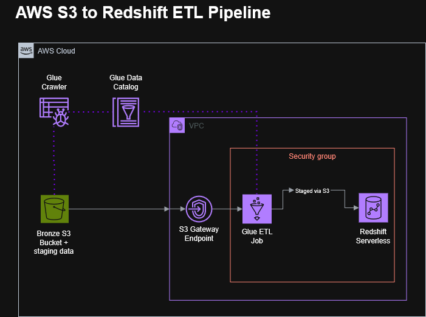

# S3 to Redshift ETL Pipeline

## Introduction

This project stands up a minimal, working AWS ETL pipeline: raw data lands in S3, AWS Glue transforms it, and the result loads into Amazon Redshift. It exists to validate every piece of infrastructure — networking, IAM, service connectivity — end to end using a small dummy dataset, before layering in real-world complexity. It's the foundation for a follow-up project that expands this same pipeline to ingest and process real healthcare data.

## Overview

The pipeline follows a simple, linear path: a CSV file uploaded to an S3 bucket is cataloged by a Glue Crawler, transformed by a Glue ETL job running inside a VPC, staged back to S3, and loaded into Redshift via `COPY`. All AWS-to-AWS traffic between Glue, Redshift, and S3 travels over a private S3 Gateway VPC endpoint rather than the public internet.

**Why no Silver/Gold S3 layer:** this project intentionally skips a full medallion architecture (bronze/silver/gold buckets). With only one lightweight transformation step and no need for reprocessing history, a single bronze bucket plus a disposable `/staging` prefix accomplishes the same goal with less infrastructure to maintain. The `/staging` prefix exists only because Redshift's `COPY` command requires reading from S3 — it's a mechanical requirement of the load step, not a deliberate data layer, and its contents expire automatically after two days via an S3 lifecycle rule.

**Why Redshift Serverless over a provisioned cluster:** Serverless bills only for active query processing rather than a fixed always-on cluster, which fits a project run in short, separate sessions rather than continuously.

**Scope of this project:** this repo covers infrastructure setup and a connectivity spike using a small hand-written CSV — the goal is proving every service can talk to every other service correctly. It intentionally does not include real source data or business transformation logic; that's the follow-up project's job (see Expansion Plan).

## Features

- VPC networking configured for private, cost-free S3 access (no NAT Gateway required)
- Self-referencing security group enabling Glue and Redshift to communicate without hardcoded IPs
- Least-privilege IAM roles scoped per service (Glue, Redshift, local boto3 access)
- Redshift Serverless workgroup with Secrets Manager-managed credentials
- Automated `/staging` cleanup via S3 lifecycle rule
- End-to-end validated data flow from S3 through Glue into Redshift

## Architecture

## Tech Stack

| Component                    | Purpose                                   |
| ---------------------------- | ----------------------------------------- |
| Amazon S3                    | Raw data storage and transient staging    |
| AWS Glue (Crawler + ETL job) | Schema cataloging and data transformation |
| Amazon Redshift Serverless   | Target data warehouse                     |
| AWS IAM                      | Scoped access control per service         |
| AWS Secrets Manager          | Redshift credential storage               |
| Amazon VPC                   | Private networking between services       |

## Roadmap

**Completed — infrastructure and connectivity spike:**

- [x] Confirmed default VPC and created a self-referencing security group (port 5439)
- [x] Created an S3 Gateway VPC endpoint for private, free S3 access
- [x] Created an IAM user for local boto3 access, scoped to the bronze bucket
- [x] Created an IAM role for Glue (S3 read/write, Glue Catalog, Secrets Manager)
- [x] Stood up a Redshift Serverless namespace and workgroup with an associated IAM role for S3 read access
- [x] Configured an S3 lifecycle rule to expire `/staging` objects after two days
- [x] Uploaded a dummy CSV to S3
- [x] Ran a Glue Crawler to catalog data
- [x] Created a Glue Studio connection to Redshift and validated it with Test Connection
- [x] Built a Glue ETL job that reads the cataloged CSV, applies a trivial transform, and loads it into a Redshift table via the built-in Redshift connector
- [x] Confirmed data landed correctly in Redshift with a row-count check

## Expansion Plan

This project is the foundation for a follow-up pipeline that will:

- Replace the dummy CSV with real synthetic patient data in FHIR format
- Add a local Python ingestion layer using **boto3**, evolving from batch uploads toward **stream processing** of incoming FHIR data, with each upload automatically triggering the downstream pipeline via EventBridge rather than being kicked off manually
- Automate the manual Crawler → ETL job sequence using **Amazon EventBridge**:
  - Configure an S3 event notification (via EventBridge) to fire when a new object lands in the bronze bucket
  - Trigger the Glue Crawler automatically in response to that event, rather than running it manually
  - Chain a second EventBridge rule (or a Glue trigger) to start the ETL job once the Crawler completes successfully
  - Add a failure-path rule (e.g., an EventBridge target that sends a notification via SNS) if the Crawler or job fails, rather than only discovering issues on manual inspection
- Extend the Glue ETL job with real FHIR-specific flattening logic (parsing nested resources, resolving cross-resource references)
- Expand Redshift table design to support the full target schema (Patient, Encounter, Condition, Observation)

### Actions to Take Based on Lessons Learned

**Maintain a detailed process document.**
Setting up an ETL pipeline in AWS involves many interdependent services, and small configuration gaps (a missing VPC endpoint, a mismatched schema, a stale IAM policy) are easy to lose track of without a written record. A process document should include:

- Steps taken to configure each service and its permissions
- Service connection configuration and the order dependencies between steps
- Context on intermediate actions required between major setup steps
- Root causes of issues encountered and how they were resolved

<!-- See the companion repository for that build. -->
